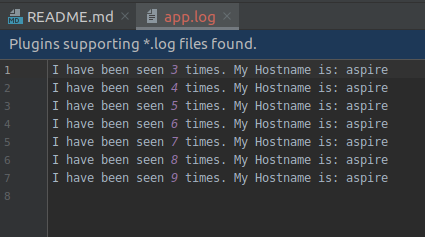
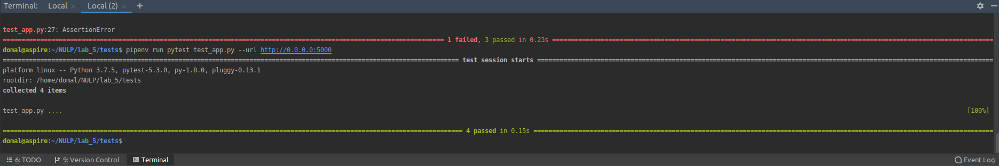
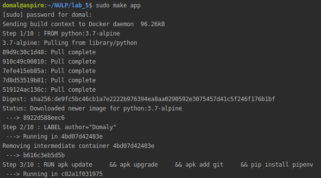
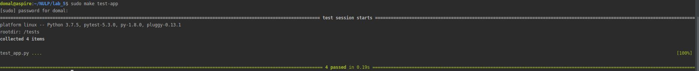
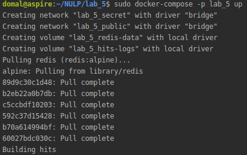
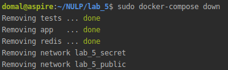
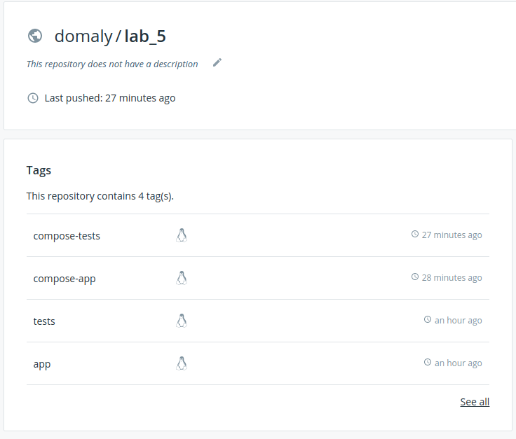
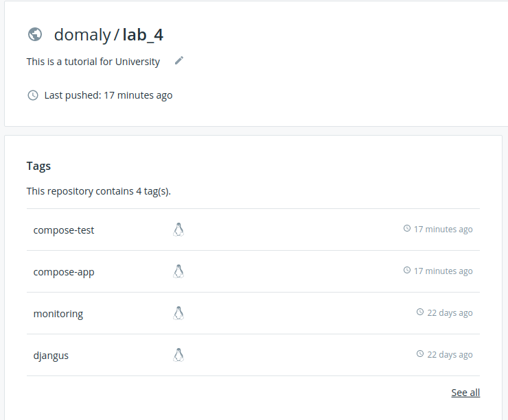

1) done.

2) done.

3) done.

4) done.

5) done.

6) done.

7) done.

8) done.

9) done.

10) done.

11) done.

12) done.

13) done.

14) done.

15) localhost://8080

16) done.

17) done.

18) done.

19) На мою думку yml-файли зручніші для автоматизації, але makefile дозволяють більш конктерно реалізувати завдання.

20) done.

21) done.
